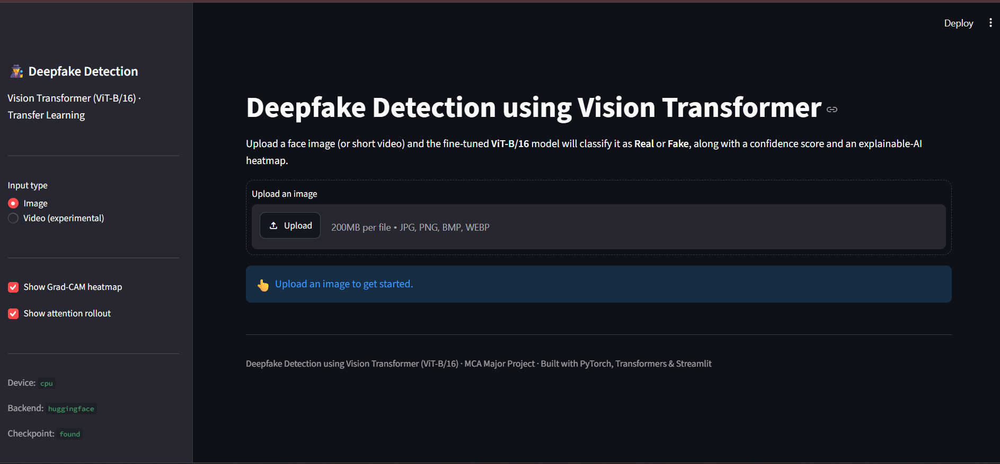
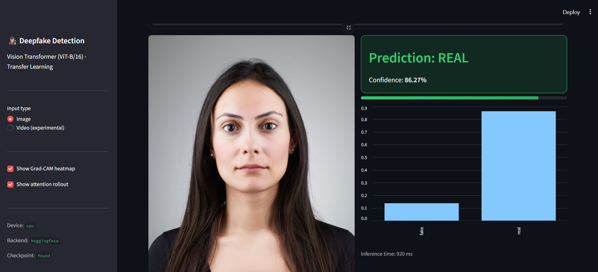

# 🧠 Deepfake Detection using Vision Transformer (ViT)

<p align="center">


</p>

<p align="center">
An end-to-end Deep Learning system for detecting AI-generated and manipulated facial images using Vision Transformer (ViT-B/16).
</p>

---

# 📌 Project Overview

Deepfake technology has created serious challenges in digital security, media authenticity, and online trust. This project develops an intelligent deepfake detection system that classifies facial images into:

* ✅ Real Images
* ❌ Fake / AI Generated Images

The system uses **Transfer Learning with Vision Transformer (ViT-B/16)** pretrained on ImageNet-21k and fine-tuned for binary image classification.

The complete pipeline includes:

* Data preprocessing
* Exploratory Data Analysis
* Model training
* Performance evaluation
* Explainable AI visualization
* Streamlit deployment

---

# 🎯 Objectives

* Develop a Real vs Fake image classification model using Vision Transformer.
* Build a complete and reproducible deep learning workflow.
* Apply Explainable AI techniques to understand model decisions.
* Create an interactive web application for prediction.
* Design a professional GitHub-ready AI project.

---

# ✨ Features

## 🤖 Deep Learning Model

* Vision Transformer (ViT-B/16)
* Transfer learning approach
* Pretrained ImageNet-21k weights
* Custom classification head
* Backbone freezing and fine-tuning support
* AdamW optimizer
* Cosine learning rate scheduler

## 📊 Data Analysis

Implemented complete EDA pipeline:

* Class distribution analysis
* Image sample visualization
* Resolution analysis
* Pixel intensity analysis
* Data augmentation techniques

## 📈 Model Evaluation

Performance evaluation using:

* Accuracy
* Precision
* Recall
* F1 Score
* ROC-AUC Score

Generated visual reports:

* Confusion Matrix
* ROC Curve
* Precision-Recall Curve
* Training and Validation Curves

## 🔍 Explainable AI (XAI)

The model provides interpretability using:

* Grad-CAM visualization
* Attention Rollout

## 🌐 Streamlit Application

Interactive web interface with:

* Image upload
* Real/Fake prediction
* Confidence score
* Probability visualization
* Explainability heatmaps
* Video frame analysis support

---

# 🏗️ System Architecture

```
Input Image / Video
          |
          ↓
 Image Preprocessing
          |
          ↓
 Data Augmentation
          |
          ↓
 Vision Transformer
       (ViT-B/16)
          |
          ↓
 Classification Head
          |
          ↓
 Real / Fake Prediction
          |
          ↓
 Explainable AI Output
```

---

# 📂 Project Structure

```
Deepfake-Detection-ViT/

│
├── dataset/
│   ├── train/
│   ├── validation/
│   └── test/
│
├── notebooks/
│   └── Deepfake_Detection_ViT.ipynb
│
├── src/
│   ├── dataset.py
│   ├── model.py
│   ├── metrics.py
│   ├── eda.py
│   ├── gradcam.py
│   └── video_utils.py
│
├── models/
│   └── best_model.pth
│
├── outputs/
│   ├── plots/
│   ├── logs/
│   └── predictions/
│
├── reports/
│   ├── Project_Report.docx
│   └── Project_Presentation.pptx
│
├── train.py
├── test.py
├── predict.py
├── app.py
├── config.py
├── requirements.txt
└── README.md

```

---

# ⚙️ Installation

Clone the repository:

```bash
git clone https://github.com/ankit-kumar9648/Deepfake-Detection-ViT.git
```

Navigate to project directory:

```bash
cd Deepfake-Detection-ViT
```

Create virtual environment:

```bash
python -m venv venv
```

Activate environment:

Windows:

```bash
venv\Scripts\activate
```

Install dependencies:

```bash
pip install -r requirements.txt
```

---

# 📁 Dataset Structure

Dataset should follow ImageFolder format:

```
dataset/

├── train/
│   ├── real/
│   └── fake/
│
├── validation/
│   ├── real/
│   └── fake/
│
└── test/
    ├── real/
    └── fake/

```

Supported datasets:

* FaceForensics++
* Celeb-DF
* DFDC
* Real and Fake Face Dataset

---

# 🚀 Model Training

Train the model:

```bash
python train.py
```

Custom training:

```bash
python train.py --epochs 15 --batch-size 16 --lr 3e-4
```

Generated model files:

```
models/

├── best_model.pth
└── last_model.pth

```

---

# 🧪 Model Testing

Run evaluation:

```bash
python test.py
```

Generated outputs:

```
outputs/

├── test_metrics.json
├── confusion_matrix.png
├── roc_curve.png
└── pr_curve.png

```

---

# 🔮 Prediction

For single image prediction:

```bash
python predict.py --image image.jpg
```

Example output:

```
Prediction : Fake
Confidence : 96.8%

```

---

# 🌐 Run Streamlit Application

Start application:

```bash
streamlit run app.py
```

Application provides:

✅ Image upload

✅ Real/Fake classification

✅ Confidence score

✅ Explainable AI visualization

✅ Video frame analysis

---

# 📸 Application Screenshots


## 🏠 Streamlit Application Interface

The deployed Streamlit application provides an interactive interface for uploading images/videos and performing deepfake detection using Vision Transformer.





---

## 🤖 Real Image Prediction Result

The model successfully classifies uploaded facial images and provides prediction probability with confidence score.





---

## 🔍 Explainable AI Visualization

Grad-CAM and Attention Rollout visualization will be added after final integration.


```
assets/

├── home.png
├── prediction.png
└── gradcam.png

```

---

# 🛠️ Tech Stack

| Category                | Technologies                  |
| ----------------------- | ----------------------------- |
| Programming Language    | Python                        |
| Deep Learning Framework | PyTorch                       |
| Model Architecture      | Vision Transformer (ViT-B/16) |
| Computer Vision         | OpenCV, Pillow                |
| Data Processing         | NumPy, Pandas                 |
| Visualization           | Matplotlib                    |
| Machine Learning        | Scikit-learn                  |
| Explainability          | Grad-CAM                      |
| Deployment              | Streamlit                     |

---

# 🔮 Future Scope

* Real-time video deepfake detection
* Video Transformer based models
* Face detection and alignment using MTCNN
* Ensemble models (ViT + CNN)
* FastAPI based deployment
* Robustness testing against compression and noise

---

# 👨‍💻 Author

## Ankit Kumar

MCA - Data Science & Artificial Intelligence

GitHub:
https://github.com/ankit-kumar9648

---

# 📜 License

This project is developed for academic and research purposes.
